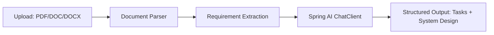

# Requirements-to-Design Generator

A Spring AI–based tool that ingests business requirement documents and produces a technical task breakdown and system design — automating the handoff between business analysis and engineering planning.

## What It Does

1. **Input:** Accepts business requirements as a readable document (PDF, DOC, or DOCX).
2. **Processing:** Parses and analyzes the requirements using Spring AI, grounding all generated output in the source document.
3. **Output:**
   - A structured breakdown of technical tasks derived from the requirements
   - A system design covering the components/architecture needed to satisfy them

## Why This, Not Just a Chatbot

Generic document Q&A tools can summarize or answer questions about a requirements doc, but they don't produce structured engineering artifacts. This tool is scoped narrowly to one workflow — requirements in, technical plan out — so the output is immediately usable by an engineering team rather than requiring further interpretation.

## Tech Stack

- Java / Spring Boot
- Spring AI

## Architecture



## Running Locally

```bash
git clone https://github.com/offiank/engineering_leadership_portfolio.git
cd "engineering_leadership_portfolio/Java Code/req2task"
```

---

> Shared for portfolio review. See the repository [LICENSE](../../LICENSE) for usage terms.
