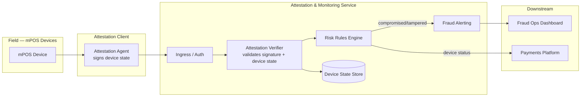

# Device Attestation Architecture

**System:** Attestation & Monitoring Service · Girmiti Software
**Related case study:** [attestation-monitoring.md](../case-studies/attestation-monitoring.md)

## Problem

Tens of thousands of mPOS devices operate in the field, outside any physically controlled environment. A compromised or tampered device can be used to intercept card data or inject fraudulent transactions. We needed a way to continuously verify device integrity and flag compromise **without** disrupting legitimate transaction flow or requiring a network round-trip on every single payment.

## Constraints

- Devices are low-power, field-deployed, and not always online.
- False positives (flagging a legitimate device) directly block a merchant from taking payment — the cost of an error is asymmetric.
- Attestation logic had to be verifiable server-side without trusting the device's own report of its state.
- Needed to scale to tens of thousands of devices without a proportional increase in backend load.

## Architecture

**Flow:**
1. An attestation agent on each device periodically signs a snapshot of device state (firmware hash, tamper flags, environment checks) with a device-bound key.
2. The signed report is sent to the Attestation & Monitoring Service, which independently verifies the signature and cross-checks device state against known-good baselines — the device's own claim is never trusted blindly.
3. A risk rules engine evaluates verified state against fraud heuristics and flags anomalies.
4. Compromised or tampered devices are flagged to fraud operations and their status is surfaced to the payments platform, which can restrict or block transactions from that device.

## Key Decisions & Trade-offs

- **Async attestation over per-transaction checks:** attestation runs on a periodic cycle rather than blocking every transaction, trading a small detection-latency window for no added transaction latency.
- **Server-side verification of signed state, not device self-report:** more implementation overhead, but removes the device itself as a trusted party — critical since the device is exactly what might be compromised.
- **Separate risk rules engine from the verifier:** decoupling attestation (is this report valid?) from risk scoring (does this state indicate fraud?) let the fraud rules evolve independently without touching the cryptographic verification path.

## What I'd Do Differently

Given more lead time, I'd invest earlier in a formal threat model review with security before finalizing the agent-to-backend protocol, rather than iterating on it post-launch — we caught and fixed some edge cases in production that a earlier review would have surfaced sooner.
