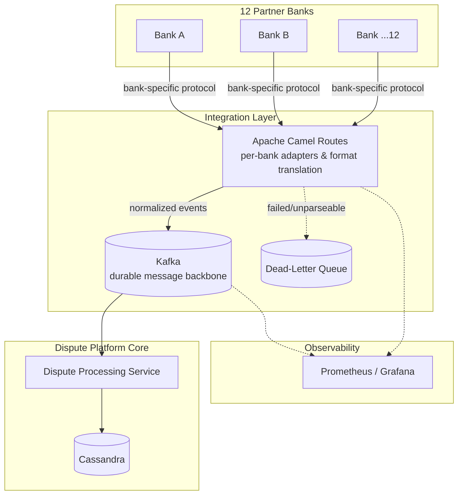

# Multi-Bank Integration Layer

**System:** NPCI Dispute Platform · Girmiti Software
**Related case study:** [npci-dispute-platform.md](../case-studies/npci-dispute-platform.md)

## Problem

NPCI's dispute-resolution platform needed to integrate with 12 partner banks, each with its own message formats, protocols, and reliability characteristics, while processing 10B+ transactions/month at 99.99% availability. A failure or slowdown at any single bank could not be allowed to degrade the platform for the other 11.

## Constraints

- 12 heterogeneous bank integrations, each with different formats and SLAs.
- National-scale transaction volume with a hard 99.99% availability target.
- Disputes are financially sensitive — message loss or duplication is unacceptable.
- New banks needed to be onboardable without re-architecting the core platform.

## Architecture

**Flow:**
1. Apache Camel routes act as per-bank adapters, translating each bank's native format into a normalized internal event schema — isolating bank-specific quirks at the edge rather than letting them leak into core dispute logic.
2. Normalized events are published to Kafka, which acts as a durable buffer between integration and processing — a slow or unavailable bank connection doesn't block processing of events from the other 11.
3. Messages that fail translation or validation go to a dead-letter queue for manual/automated reconciliation, rather than being silently dropped or blocking the pipeline.
4. The dispute processing service consumes from Kafka independently of the ingestion rate, and Prometheus/Grafana track per-bank throughput, error rate, and lag to catch degradation early.

## Key Decisions & Trade-offs

- **Camel for adapter isolation:** using Camel's routing/translation DSL per bank kept the "messy" integration logic contained and made onboarding a 13th bank a matter of adding a route, not modifying shared code.
- **Kafka as a durability buffer, not just a queue:** decoupling ingestion from processing meant a bank-side outage degraded gracefully (backlog, not data loss) instead of cascading into the core platform's availability numbers.
- **Dead-letter queue over fail-fast:** for financially sensitive dispute data, silently dropping or hard-failing a malformed message was worse than quarantining it for review — the DLQ traded some manual-ops overhead for correctness guarantees.

## What I'd Do Differently

I'd push for standardizing a canonical bank-integration contract (schema + SLA expectations) earlier in the program, before the first few banks were onboarded — a couple of early integrations ended up needing rework once patterns across banks became clearer.
