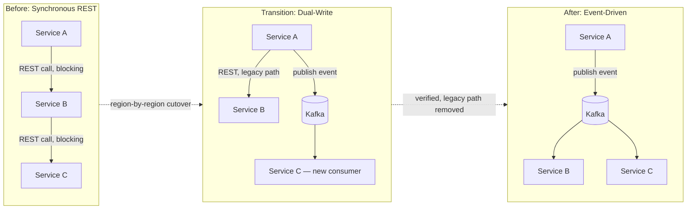

# REST to Event-Driven Migration

**System:** Core Platform, multi-region · Girmiti Software
**Related case study:** [rest-to-kafka-migration.md](../case-studies/rest-to-kafka-migration.md)

## Problem

Core services communicated via synchronous REST calls, creating tight coupling: a slowdown in one service propagated latency (or failures) directly to its callers, and scaling one service independently of its dependents was difficult. The goal was to move to Kafka-based event pipelines on Kubernetes — across 3 global regions — without any customer-facing downtime, while also migrating the underlying Postgres schema live.

## Constraints

- Zero downtime tolerance — this was a live, revenue-critical platform.
- 3 global regions had to be migrated without a "big bang" cutover.
- A live schema migration had to happen concurrently with the architectural shift.
- Rollback had to be possible at every stage, not just at the end.

## Architecture

**Migration strategy:**
1. **Dual-write phase:** producing services wrote to both the legacy REST path and a new Kafka topic simultaneously, so consumers could migrate independently and legacy callers kept working unchanged.
2. **Region-by-region rollout:** each of the 3 regions was migrated separately, with the others acting as a safety net — a problem in one region's rollout didn't require reverting all three.
3. **Shadow validation:** new event-driven consumers ran alongside the legacy path, and their output was compared before legacy traffic was cut over, rather than trusting the new path on day one.
4. **Concurrent schema migration:** the Postgres schema changes were rolled out using backward-compatible, expand-then-contract steps (add new columns/tables, backfill, switch reads, then drop old structures) so the schema migration never required a synchronized "flip" with the messaging migration.
5. **Legacy removal:** once a region's event-driven path was verified stable, the REST path and dual-write logic were removed for that region.

## Key Decisions & Trade-offs

- **Dual-write over big-bang cutover:** added temporary complexity and infrastructure cost (writing twice), but made the migration reversible at every step — the single most important property for a zero-downtime requirement.
- **Region-by-region rather than global cutover:** slower to complete overall, but contained blast radius and let the team learn from region 1 before touching region 2 and 3.
- **Expand-contract schema migration decoupled from the messaging cutover:** kept two hard problems (schema change, transport change) from being solved simultaneously under the same rollback window.

## What I'd Do Differently

I'd formalize the shadow-validation comparison (automated diffing of legacy vs. new-path output) earlier — early on this was partly manual, which slowed down how quickly we could trust a region's cutover.
